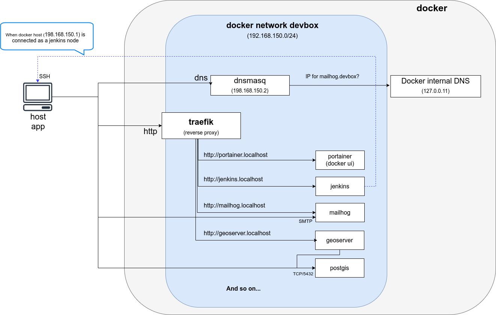

# mborne/docker-devbox

This repository provides a framework to setup a **local dev environment** with docker.

## Key points

* [docker-compose](https://docs.docker.com/compose/) is used to define and start each service (ex : [kibana/docker-compose.yml](kibana/docker-compose.yml))
* [traefik](https://hub.docker.com/_/traefik) provides nice URL for web services (ex : http://kibana.localhost)
* Containers run on the same network named `devbox` to simplify communication between containers/stacks
* Named volumes allows data persistence to ease the purge of running services

It also provides a set of sample stacks (usual dependencies for my projects, sandbox, experiments, etc.)

## Schema

## Usage

* Ensure that you have a correct docker daemon configuration (`/etc/docker/daemon.json`) :

  * Configure `bip` and `default-address-pools` to avoid IP overlaps on your LAN
  * Configure `storage-driver` to "overlay2"
  * ...

> Note that you may have a look at least to [docker-bench-security](https://github.com/docker/docker-bench-security) to avoid main security issues.

* Get started running [traefik](traefik/README.md) and [whoami](whoami/README.md) which provides a simple example to understand traefik.

## Stacks

### Core services

| Name                             | Description                                                                                 |
| -------------------------------- | ------------------------------------------------------------------------------------------- |
| [traefik](traefik/README.md)     | Reverse proxy providing URLs according to labels (ex : `http://<service>.${HOST_HOSTNAME}`) |
| [whoami](whoami/README.md)       | Trivial service to test and understand traefik                                              |
| [portainer](portainer/README.md) | Docker web UI                                                                               |

## ELK

| Name                                     | Description             |
| ---------------------------------------- | ----------------------- |
| [elasticsearch](elasticsearch/README.md) | elasticsearch (2 nodes) |
| [kibana](kibana/README.md)               | kibana                  |

### Spatial

| Name                                                               | Description                                       |
| ------------------------------------------------------------------ | ------------------------------------------------- |
| [postgis](https://github.com/mborne/docker-postgis#docker-postgis) | Store spatial data (tables with geometry columns) |
| [geoserver](geoserver/README.md)                                   | Render spatial data (WMS, WFS, WMTS)              |
| [geonetwork](geonetwork/README.md) (CSW, CSW-T)                    | Store metadata (CSW, CSW-T)                       |
| [postgis-integration](postgis-integration/README.md)               | Load opendata datasets in postgis                 |

### Authentication

| Name                               | Description              |
| ---------------------------------- | ------------------------ |
| [openldap](openldap/README.md)     | LDAP server and admin UI |
| [keycloak](keycloak/README.md)     | Identity provider        |
| [fusionauth](fusionauth/README.md) | Identity provider        |

### Storage

| Name                             | Description                                   |
| -------------------------------- | --------------------------------------------- |
| [gogs](gogs/README.md)           | GIT hosting                                   |
| [nexus](nexus/README.md)         | Artefact hosting (docker image, deb, rpm,...) |
| [nextcloud](nextcloud/README.md) | File hosting                                  |

### Continuous integration

| Name                             | Description           |
| -------------------------------- | --------------------- |
| [jenkins](jenkins/README.md)     | Continous Integration |
| [sonarqube](sonarqube/README.md) | Code quality          |

### CMS

| Name                             | Description |
| -------------------------------- | ----------- |
| [wordpress](wordpress/README.md) | CMS         |
| [drupal](drupal/README.md)       | CMS         |

### Various

| Name                           | Description                        |
| ------------------------------ | ---------------------------------- |
| [mailhog](mailhog/README.md)   | Web and API based SMTP test server |
| [rabbitmq](rabbitmq/README.md) | Message broker                     |
| [drupal](drupal/README.md)     | CMS                                |
| [netdata](netdata/README.md)   | Monitoring                         |
| [adminer](adminer/README.md)   | Database management                |

## License

[MIT](LICENSE)
