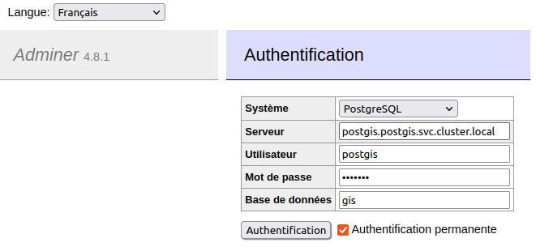

# adminer

Container running [adminer](https://hub.docker.com/_/adminer/).

## Usage with docker

* Start adminer : `docker compose up -d`
* Open https://adminer.dev.localhost/

## Usage with Kubernetes

Read [k8s-install.sh](k8s-install.sh) and run :

```bash
# To get adminer on http://adminer.dev.localhost
bash k8s-install.sh
# To get adminer on http://adminer.example.net
DEVBOX_HOSTNAME=example.net bash k8s-install.sh
```

## Login to database

With [PostGIS deployed with Kustomize](../postgis/README.md#usage-with-kustomize) :



