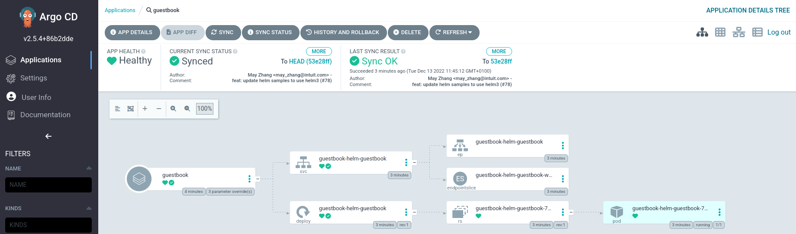

# Argo CD

Container running [Argo CD](https://argo-cd.readthedocs.io/en/stable/) which provides an UI to deploy with helm or Kustomize in a Kubernetes cluster :



## Usage with Kubernetes

* Read [k8s-install.sh](k8s-install.sh) and run :

```bash
# To get ArgoCD on http://argocd.dev.localhost
bash k8s-install.sh
# To get ArgoCD on http://argocd.example.net
DEVBOX_HOSTNAME=example.net bash k8s-install.sh
```

* Retrieve initial admin password : `kubectl -n argocd get secret argocd-initial-admin-secret -o jsonpath="{.data.password}" | base64 -d; echo`
* Open http://argocd.dev.localhost
* Add some apps (see [argoproj/argocd-example-apps](https://github.com/argoproj/argocd-example-apps))

## Using ArgoCD behind a proxy

If setting http_proxy and https_proxy is required to reach GIT repositories, **use [Argo Helm Charts](https://github.com/argoproj/argo-helm#argo-helm-charts)** and see [github.com - Setting proxy in argocd server](https://github.com/argoproj/argo-cd/issues/2954#issuecomment-843260694).

## Resources

* [argo-cd.readthedocs.io - Getting Started](https://argo-cd.readthedocs.io/en/stable/getting_started/)
* [argo-cd.readthedocs.io - Manage Argo CD Using Argo CD](https://argo-cd.readthedocs.io/en/stable/operator-manual/declarative-setup/#manage-argo-cd-using-argo-cd) (example of kustomization)
* [argo-cd.readthedocs.io - Operator Manual - Ingress Configuration](https://argo-cd.readthedocs.io/en/stable/operator-manual/ingress/#ingress-configuration)
