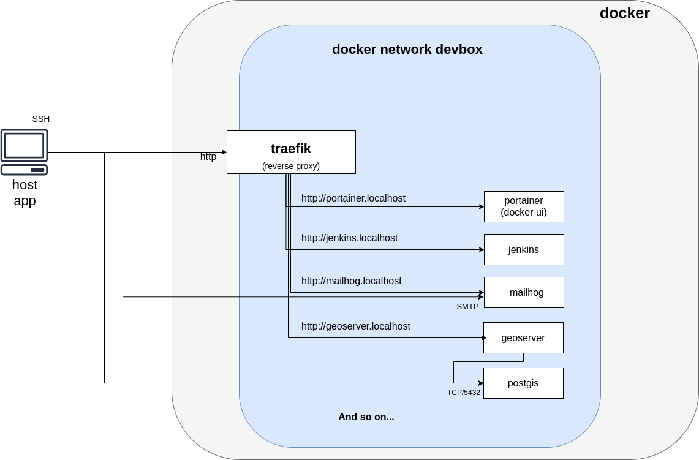

# Notes about docker-compose

## Key points

* [docker-compose](https://docs.docker.com/compose/) is used to define and start each service (ex : [kibana/docker-compose.yml](kibana/docker-compose.yml))
* [traefik](https://hub.docker.com/_/traefik) provides nice URL for web services (ex : https://kibana.dev.localhost)
* [mkcert](https://github.com/FiloSottile/mkcert#mkcert) is used to generate a wildcard certificate for `*.dev.localhost` with a locally trusted rootCA (`*.localhost`)
* Containers run on the same network named `devbox` to simplify communication between containers/stacks
* Named volumes allows data persistence to ease the purge of running services

## Schema

## Port mapping

Most service ports are only exposed on `127.0.0.1` as docker overwrites `iptables` or [UFW](https://help.ubuntu.com/community/UFW) rules.

## Docker configuration

* Ensure that you have a correct docker daemon configuration (`/etc/docker/daemon.json`) :

  * Configure `bip` and `default-address-pools` to avoid IP overlaps on your LAN
  * Configure `storage-driver` to "overlay2"
  * ...

* You may have a look at least to [docker-bench-security](https://github.com/docker/docker-bench-security) to avoid main security issues.

## Traefik as a service

To ease IP filtering and avoid the requirement for the containers to share the traefik network, it is easier to install traefik as a service.

See [mborne/ansible-traefik](https://github.com/mborne/ansible-traefik#ansible-traefik) which illustrates traefik deployment as a systemd service.
