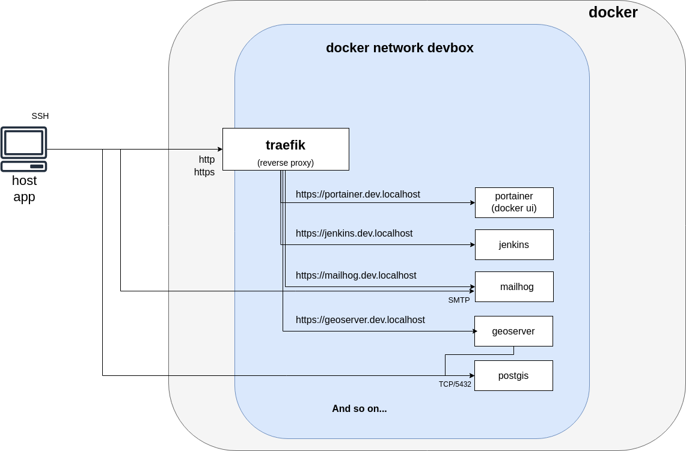

# Usage with docker

## Requirements

> See [docs.docker.com - Install Docker Engine on Ubuntu](https://docs.docker.com/engine/install/ubuntu/)

* [Docker Engine](https://docs.docker.com/engine/)
* [Docker Compose](https://docs.docker.com/compose/)

## Schema

<div style="text-align:center">

</div>

## Stacks management

* Stacks are managed with [docker compose](https://docs.docker.com/compose/) (`docker compose up -d`)
* Stacks can be stopped/downed without loosing data as **named volumes** are used for persistence (use `docker compose down --volumes` to explicitly delete volumes)

## Networking and service exposition

* Applications are exposed **on nice URL** (ex : https://kibana.dev.localhost) with the reverse proxy [traefik](../traefik/README.md).
* An environment variable `DEVBOX_HOSTNAME` allows to customize `dev.localhost`
* An helper script is provided to generate wildcard certificates for [traefik](../traefik/README.md) with [mkcert](https://github.com/FiloSottile/mkcert#mkcert) a wildcard certificate ([traefik/mkcert/generate.sh](../traefik/mkcert/generate.sh)).
* All stacks runs on the same network named `devbox` to simplify communication between containers/stacks.

> `dev.localhost` is preferred to `localhost` as it allows wildcard certificate generation.

## Port mapping

By default, service ports (ex : 5342 for PostgreSQL) are only exposed on `127.0.0.1` for security consideration :

* My IDP enables IPV6 with no descent firewall.
* Docker overwrites `iptables` or [UFW](https://help.ubuntu.com/community/UFW) rules (so that is not trivial to configure a local firewall).

Note that you can overwrite this behavior by defining `DEVBOX_PORT_PREFIX` before starting stacks :

```bash
export DEVBOX_PORT_PREFIX=""
cd redis
docker compose up -d
```

## Docker configuration

* Ensure that you have a correct docker daemon configuration (`/etc/docker/daemon.json`) :

  * Configure `bip` and `default-address-pools` to avoid IP overlaps on your LAN
  * Configure `storage-driver` to "overlay2"
  * ...

* You may have a look at least to [docker-bench-security](https://github.com/docker/docker-bench-security) to avoid main security issues.

## Docker networking and Traefik

To ease **IP whitelisting** and **avoid the requirement to share the same network** between traefik and exposed containers, note that **traefik can be installed as a systemd service**.

An alternative consists in using `network_mode: 'host'` on [traefik/docker-compose.yml](../traefik/docker-compose.yml).

In both cases :

* traefik will see real client ip
* traefik will be able to forward to any container

Note that :

* The main limitation is that you may face problem using middlewares like [thomseddon/traefik-forward-auth](https://github.com/thomseddon/traefik-forward-auth#traefik-forward-auth----) (when `http://traefik-forward-auth:4181` is referenced in a middleware, docker internal DNS doesn't seams to be invoked to resolve `traefik-forward-auth`)
* Kubernetes solves this issue with a different networking approach (by default, *"A Pod can communicate with another Pod by directly addressing its IP address"* without an explicit network sharing)


## Resources

[docs.docker.com - Reference documentation](https://docs.docker.com/reference/) :

* [docs.docker.com / Docker CLI (docker)](https://docs.docker.com/engine/reference/run/) for `docker ...` commands
* [docs.docker.com / Docker CLI (docker) / docker compose](https://docs.docker.com/compose/reference/) for `docker compose...` commands
* [docs.docker.com / Docker CLI (docker) / docker context](https://docs.docker.com/engine/reference/commandline/context/) to use a remote daemon engine through SSH for example.
* ...

Ansible playbooks :

* [mborne/ansible-docker-ce](https://github.com/mborne/ansible-docker-ce#readme) to install docker community engine with Ansible and configure it according to [docker-bench-security](https://github.com/docker/docker-bench-security) recommandations (**Warning: Don't use this one at IGNF or ENSG**, contact me)
* [mborne/ansible-traefik](https://github.com/mborne/ansible-traefik#ansible-traefik) to deploy traefik as systemd service with Ansible.


