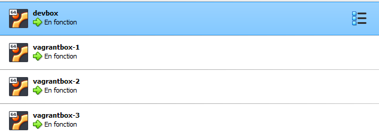

# Notes about Kubernetes

## Key points

* [Kustomize](https://kustomize.io/) and [helm](https://helm.sh/) are used to deploy stack
* A `k8s-deploy.sh` script is provided to ease deployment and to inject `DEVBOX_HOSTNAME` in [Ingress](https://kubernetes.io/docs/concepts/services-networking/ingress/) resources creation.
* Deployments are mainly tested with [K3S](https://k3s.io) where default traefik setup is disabled (see [mborne/k3s-deploy](https://github.com/mborne/k3s-deploy)).
* `DEVBOX_HOSTNAME` is defaulted to `dev.localhost` but it can be customized to use a custom domain.
* [Traefik](../traefik/README.md) is the [Ingress Controller](https://kubernetes.io/docs/concepts/services-networking/ingress-controllers/) providing nice URL according to Ingress definitions.
* Get started with [traefik](../traefik/README.md) and [whoami](../whoami/README.md)

## Multiple K3S nodes and custom domain

You may have a look to [mborne/vagrantbox](https://github.com/mborne/vagrantbox) and [mborne/k3s-deploy](https://github.com/mborne/k3s-deploy) to create a K3S cluster with 3 VM using Vagrant and Ansible :

As `*.dev.quadtreeworld.net` is configured to resolve on `vagrantbox-1` private IP, it allows to use `DEVBOX_HOSTNAME=dev.quadtreeworld.net` to test K8S deployments.

## Resources

* [K3S](https://k3s.io) is quite trivial to setup on a single node

