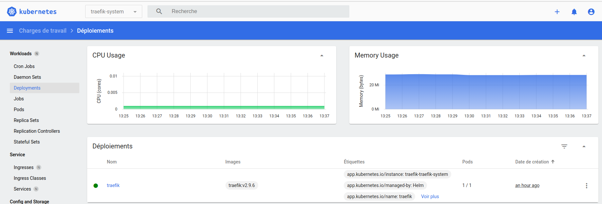

# kubernetes-dashboard

Container running [Kubernetes Dashboard](https://github.com/kubernetes/dashboard/#kubernetes-dashboard) :



## Usage with Kubernetes

* Read [k8s-install.sh](k8s-install.sh) (note that only https is supported) and run :

```bash
# To get kubernetes-dashboard on https://k8s-dashboard.dev.localhost
bash k8s-install.sh
# To get kubernetes-dashboard on https://k8s-dashboard.example.net
DEVBOX_HOSTNAME=example.net bash k8s-install.sh
```

* Get admin-user token : `kubectl -n kubernetes-dashboard create token admin-user`

* Open https://k8s-dashboard.dev.localhost

> Note that you could also use `kubectl proxy` with http://localhost:8001/api/v1/namespaces/kubernetes-dashboard/services/https:kubernetes-dashboard:/proxy/

## Resources

* [kubernetes.io - Tableau de bord (Dashboard)](https://kubernetes.io/fr/docs/tasks/access-application-cluster/web-ui-dashboard/)
* [github.com - kubernetes/dashboard](https://github.com/kubernetes/dashboard/)
* [sysdogs.com - How to deploy Kubernetes Dashboard?](https://sysdogs.com/articles/how-to-deploy-kubernetes-dashboard) (deals with ingress exposition with nginx / cert-manager)

