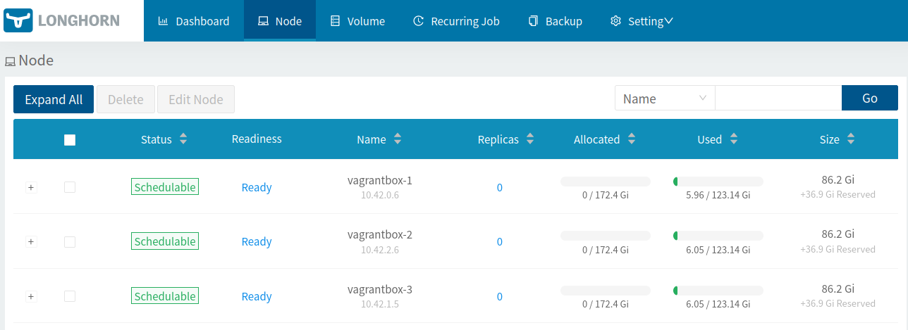

# Longhorn

Container runner [Longhorn](https://longhorn.io/) which is a cloud native distributed block storage for Kubernetes :



## System requirements

```bash
sudo apt-get install open-iscsi
sudo systemctl start iscsid && sudo systemctl enable iscsid
sudo systemctl status iscsid
```

## Usage with Kubernetes

Read [k8s-install.sh](k8s-install.sh) and run :

```bash
# To get dashboard on http://longhorn.dev.localhost
bash k8s-install.sh
# To get dashboard on http://longhorn.example.net
DEVBOX_HOSTNAME=example.net bash k8s-install.sh
```

* Check pod status : `kubectl -n longhorn-system get pods -w`

* Open UI : https://longhorn.dev.localhost and check nodes.

## Usage in client application

```yaml
apiVersion: v1
kind: PersistentVolumeClaim
metadata:
  name: test-pvc
spec:
  accessModes:
    - ReadWriteOnce
  storageClassName: longhorn
  resources:
    requests:
      storage: 1Gi
```

## Troubleshooting

### Running on single node

If you don't have at least 3 nodes, set the number of replicates (`data.parameters.numberOfReplicas`) to 1 :

```bash
kubectl -n longhorn-system edit cm/longhorn-storageclass
```

### Multiple default StorageClass with K3S

[Ensure that you have only one default StorageClass](https://kubernetes.io/docs/tasks/administer-cluster/change-default-storage-class/#changing-the-default-storageclass) :

```bash
# With K3S, you might see 2 default StorageClass : local-path, longhorn
kubectl get storageclass -o wide
# To don't use longhorn as the default StorageClass :
kubectl patch storageclass longhorn -p '{"metadata": {"annotations":{"storageclass.kubernetes.io/is-default-class":"false"}}}'
```

## Resources

* [Container Storage Interface (CSI) drivers list](https://kubernetes-csi.github.io/docs/drivers.html)
* [Installing K3s with Longhorn and USB storage on Raspberry Pi](https://www.jericdy.com/blog/installing-k3s-with-longhorn-and-usb-storage-on-raspberry-pi)
* [cloudolife.com - Helm install Rancher Labs Longhorn Cloud Native distributed block storage for Kubernetes](https://cloudolife.com/2020/10/03/Kubernetes-K8S/Helm/Helm-install-Rancher-Labs-Longhorn-Cloud-Native-distributed-block-storage-for-Kubernetes-K8S/)
