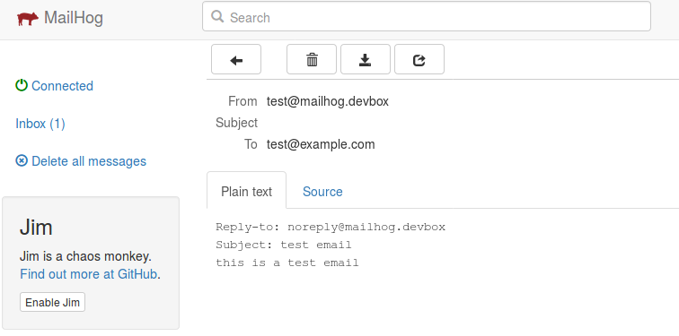

# [MailHog](https://github.com/mailhog/MailHog#readme)

Docker container running mailhog to test email sending from application

## Usage

* Start postgis : `docker-compose up -d`

* Send an email : `telnet mailhog.devbox 1025`

```bash
HELO mailhog.devbox
MAIL FROM: <test@mailhog.devbox>
RCPT TO: <test@example.com>
DATA
Reply-to: noreply@mailhog.devbox
Subject: test email
this is a test email
.
quit
```

* Open http://mailhog.localhost or http://mailhog.localhost/api/v2/messages


