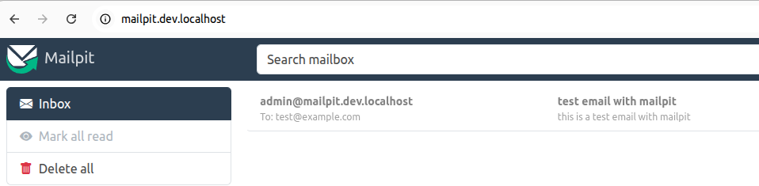

# Mailpit

[Mailpit](https://github.com/axllent/mailpit#readme) is an email & SMTP testing tool with API for developers.

## Usage with docker

* Start mailhog : `docker compose up -d`

* Send an email : `telnet localhost 1025` :

```
HELO mailpit.dev.localhost
MAIL FROM: <admin@mailpit.dev.localhost>
RCPT TO: <test@example.com>
DATA
```

```
From: admin@mailpit.dev.localhost
To: test@example.com
Reply-to: noreply@mailpit.dev.localhost
Subject: test email with mailpit

this is a test email with mailpit
.
```

```
QUIT
```

* Open http://mailpit.dev.locahost :




## Resources

* [github.com - axllent/mailpit](https://github.com/axllent/mailpit#readme)
* [mailpit.axllent.org - Mailpit features](https://mailpit.axllent.org/docs/)
* [DockerHub - axllent/mailpit](https://hub.docker.com/r/axllent/mailpit)
