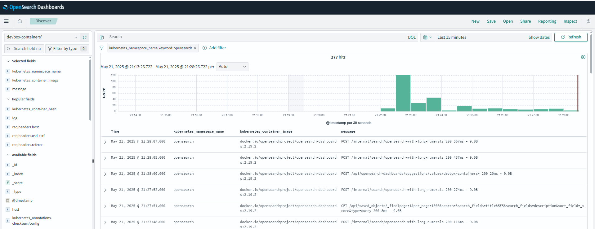

# OpenSearch

Containers running [OpenSearch](https://opensearch.org/) and [OpenSearch Dashboards](https://opensearch.org/docs/latest/dashboards/) for **DEV purpose** :



## System requirements

* [max_map_count >= 262144](../docs/max_map_count.md)

## Usage with docker

**WARNING** : Read [docker-compose.yml](docker-compose.yml) and note that **security is disabled**!

* Start containers : `docker compose up -d`
* Open https://os-dashboard.dev.localhost/

## Usage with Kubernetes

Read [k8s-install.sh](k8s-install.sh) and run :

```bash
# To get opensearch-dashboards on http://os-dashboard.dev.localhost
bash k8s-install.sh
# To get opensearch-dashboards on http://os-dashboard.example.net
DEVBOX_HOSTNAME=example.net bash k8s-install.sh
```

## See also

* http://os.dev.localhost/_cat/indices
* http://os.dev.localhost/_cluster/health

## Resources

* [opensearch.org - Install OpenSearch / Docker](https://opensearch.org/docs/latest/opensearch/install/docker/)
* [docs.opensearch.org - Installing OpenSearch / Helm](https://docs.opensearch.org/docs/2.19/install-and-configure/install-opensearch/helm/)


