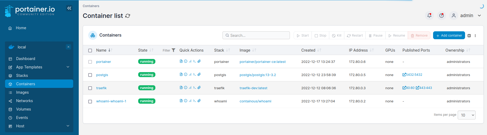

# portainer

Containers running [Portainer CE](https://hub.docker.com/r/portainer/portainer-ce) :



## Usage with docker

* Start : `docker compose up -d`
* Open https://portainer.dev.localhost
* Follow instruction to configure admin password

## Usage with Kubernetes

* Read [k8s-install.sh](k8s-install.sh) and run :

```bash
# To get portainer on https://portainer.dev.localhost
bash k8s-install.sh
# To get portainer on https://portainer.example.net
DEVBOX_HOSTNAME=example.net bash k8s-install.sh
```

* Open https://portainer.dev.localhost
* Follow instruction to configure admin password

## Resources

* [www.portainer.io](https://www.portainer.io/)
* [nextgentips.com - How to install Portainer CE with Docker-Compose](https://nextgentips.com/2022/01/26/how-to-install-portainer-ce-with-docker-compose/)
* [portainer.github.io - Deploy Portainer using Helm Chart](https://portainer.github.io/k8s/charts/portainer/)


