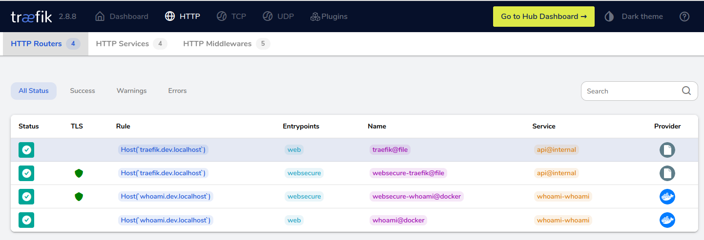

# Traefik

Container running [traefik proxy](https://doc.traefik.io/traefik/) :



## Usage with docker

* Build [mborne/traefik-dev](img/traefik-dev/README.md) image : `docker compose build --pull`
* Start traefik : `docker compose up -d`
* See [http://traefik.dev.localhost](http://traefik.dev.localhost) for web-ui
* Run [whoami](../whoami/README.md) to test traefik

See also :

* [Using mkcert to generate traefik certificates](mkcert.md)
* [mborne/traefik-dev](img/traefik-dev/README.md) to customize traefik config.

## Usage with Kubernetes

* Read [k8s-install.sh](k8s-install.sh) and run :

```bash
# To get dashboard on http://traefik.dev.localhost
bash k8s-install.sh
# To get dashboard on http://traefik.example.net
DEVBOX_HOSTNAME=example.net bash k8s-install.sh
```

* Wait for pods to be ready : `kubectl -n traefik-system get pods -w`
* Open dashboard on http://traefik.dev.localhost

## Usage with Kind

* [Create kind cluster with ingress-ready config](../kind/README.md#usage-with-ingress)
* Use [helm/kind.yml](helm/kind.yml) values to deploy with helm :

```bash
TRAEFIK_MODE=kind bash k8s-install.sh
```
* Open dashboard on http://traefik.dev.localhost


## Resources

Docker :

* [knplabs.com - How to handle https with docker-compose and mkcert for local development](https://knplabs.com/en/blog/how-to-handle-https-with-docker-compose-and-mkcert-for-local-development)
* [traefik.io - blog - Traefik Proxy 2.x and TLS 101](https://traefik.io/blog/traefik-2-tls-101-23b4fbee81f1/)

Kubernetes :

* [Traefik & Kubernetes](https://doc.traefik.io/traefik/routing/providers/kubernetes-crd/)
* [blog.tomarrell.com - Kustomize: Traefik v2.2 as a Kubernetes Ingress Controller](https://blog.tomarrell.com/post/traefik_v2_on_kubernetes)
* [www.grottedubarbu.fr - Traefik 2.2 + K3S](https://www.grottedubarbu.fr/traefik-2-k3s/)
* [www.grottedubarbu.fr - Kubernetes : Kustomize & Traefik](https://www.grottedubarbu.fr/kubernetes-kustomize-traefik/)

Other :

* [thomseddon/traefik-forward-auth](https://github.com/thomseddon/traefik-forward-auth#readme)
