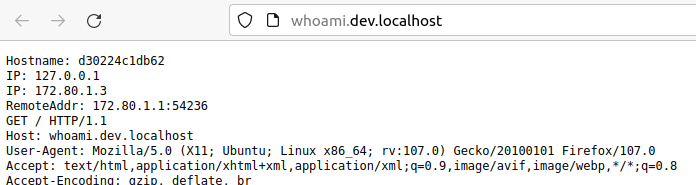

# whoami

Container running [containous/whoami](https://hub.docker.com/r/containous/whoami/dockerfile) to discover [traefik](../traefik/README.md) :



## Usage with docker

* Start 2 instances : `docker compose up -d --scale whoami=2`
* Open [http://whoami.dev.localhost](http://whoami.dev.localhost) and refresh

## Usage with Kubernetes

### Quickstart

Read [k8s-install.sh](k8s-install.sh) and run :

```bash
# To get whoami on http://whoami.dev.localhost
bash k8s-install.sh
# To get whoami on http://whoami.example.net
DEVBOX_HOSTNAME=example.net bash k8s-install.sh
```

### Step by step

* Create namespace : `kubectl create namespace whoami`

* See [whoami/manifest](whoami/manifest/README.md) and use the following command to deploy with Kustomize :

```bash
# Option 1) Deployment and Service only
kubectl -n whoami apply -k https://github.com/mborne/docker-devbox/whoami/manifest/base
# To get whoami on http://127.0.0.1:8888 :
kubectl -n whoami port-forward service/whoami 8888:80

# Option 2) Deployment, Service and Ingress ( http://whoami.dev.localhost )
kubectl -n whoami apply -k https://github.com/mborne/docker-devbox/whoami/manifest/localhost

# Option 3) Deployment, Service and Ingress ( http://whoami.dev.quadtreeworld.net )
kubectl -n whoami apply -k https://github.com/mborne/docker-devbox/whoami/manifest/qtw-dev
```


