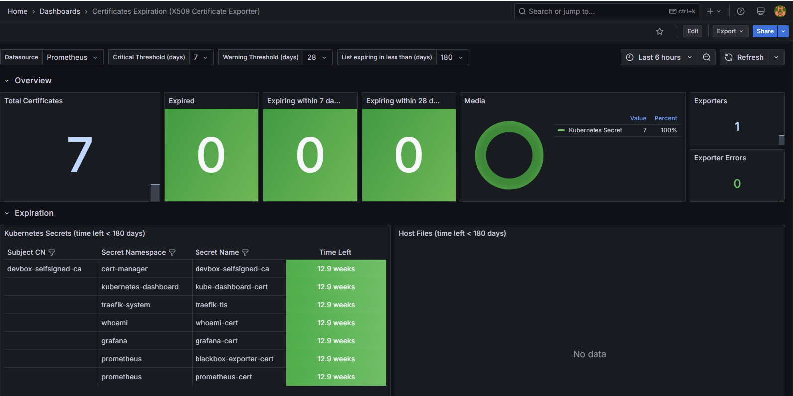

# x509-certificate-exporter

Deploy [enix/x509-certificate-exporter](https://github.com/enix/x509-certificate-exporter/tree/main?tab=readme-ov-file#-x509-certificate-exporter) to allow the monitoring of TLS certificates with [Prometheus](../prometheus/README.md) and [Grafana](../grafana/README.md).

## Requirements

* [prometheus](../README.md)
* [grafana](../README.md) with [Certificates Expiration (X509 Certificate Exporter)](https://grafana.com/grafana/dashboards/13922-certificates-expiration-x509-certificate-exporter/) dashboard.

## Usage with Kubernetes

* Read [k8s-install.sh](k8s-install.sh) and run :

```bash
bash x509-certificate-exporter/k8s-install.sh
```

* See the [Grafana](../grafana/README.md) dashboard :



## Ressources

* [github.com - enix/x509-certificate-exporter](https://github.com/enix/x509-certificate-exporter/tree/main?tab=readme-ov-file#-x509-certificate-exporter)
* [grafana.com - 13922 - Certificates Expiration (X509 Certificate Exporter)](https://grafana.com/grafana/dashboards/13922-certificates-expiration-x509-certificate-exporter/)

